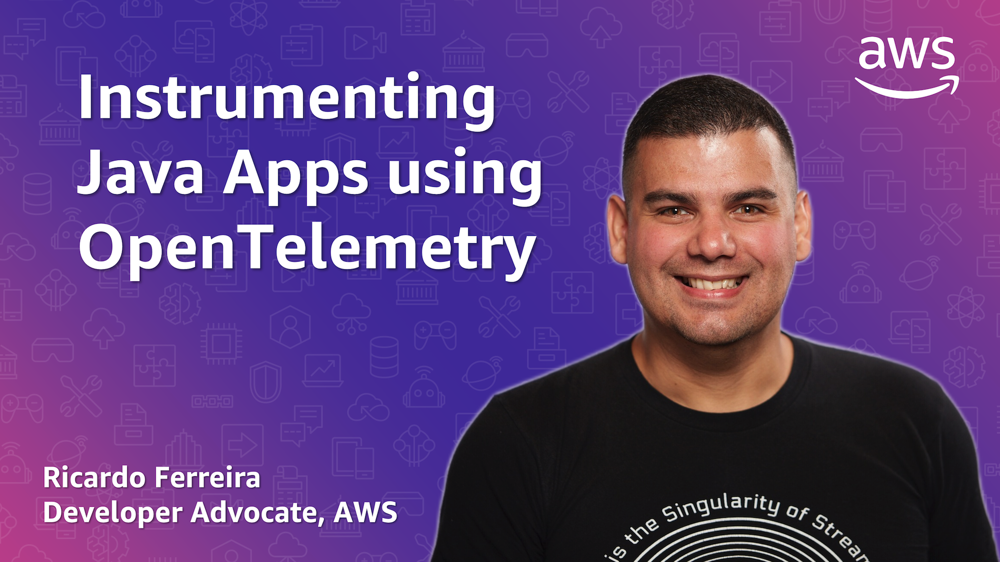

## Instrumenting Java Applications using OpenTelemetry

This project provides an example of microservice written in Java that produces telemetry data for traces and metrics using [OpenTelemetry](https://opentelemetry.io). It also shows how to de-couple the application from the observability backend using the [OpenTelemetry Collector](https://opentelemetry.io/docs/collector) and the [OTLP protocol](https://opentelemetry.io/docs/reference/specification/protocol), so you can be easily switch the observability backend for another without code changes.

💡 If you want to learn how to build this code from scratch with a hands-on tutorial, you can watch the YouTube series below.

[](https://www.youtube.com/watch?v=XvmicNH_4lc&list=PLDqi6CuDzubz5viRapQ049TjJMOCCu9MJ&index=1)

Alternatively, you can also read the blog post: https://www.buildon.aws/posts/instrumenting-java-apps-using-opentelemetry

### Requirements

* [Java 17+](https://openjdk.org/install)
* [Maven 3.8.6+](https://maven.apache.org/download.cgi)
* [Docker](https://www.docker.com/get-started)

## 🏢 Running the microservice with Grafana, Grafana Tempo, and Prometheus as observability backend.

You can have the microservice sending telemetry data to a local observability backend. Traces will be sent to [Grafana Tempo](https://grafana.com/traces) and the metrics to [Prometheus](https://prometheus.io). Then you can use [Grafana](https://grafana.com/grafana) to visualize the the generated telemetry data.

1. Start the containers using Docker Compose.

```bash
docker compose -f docker-compose.yaml up -d
```

2. Access the Grafana UI: http://localhost:3000

## 🌩 Running the microservice with AWS X-Ray and Amazon CloudWatch as observability backend.

You can have the microservice sending telemetry data to AWS as observability backend. Traces will be sent to [AWS X-Ray](https://aws.amazon.com/xray) and the metrics to [Amazon CloudWatch](https://aws.amazon.com/cloudwatch). This is possible thanks to the [AWS Distro for OpenTelemetry](https://aws.amazon.com/otel) that provides out-of-the-box integration with AWS services. Before running the code; make sure to [configure your AWS credentials](https://docs.aws.amazon.com/cli/latest/userguide/cli-configure-quickstart.html) in your machine, as the code will use them to connect with the target services.

1. Start the containers using Docker Compose.

```bash
docker compose -f docker-compose-aws.yaml up -d
```

2. Access the AWS Console: https://console.aws.amazon.com

## ⚡️ Invoke the Microservice API manually

The microservice expose an API over the port 8888 using HTTP.

1. Invoke this API for testing purposes.

```bash
curl -X GET http://localhost:8888/hello
```

## Security

See [CONTRIBUTING](CONTRIBUTING.md#security-issue-notifications) for more information.

## Disclaimers

```text
This package requires and may incorporate or retrieve a number of third-party
software packages (such as open source packages) at install-time or build-time
or run-time ("External Dependencies"). The External Dependencies are subject to
license terms that you must accept in order to use this package. If you do not
accept all of the applicable license terms, you should not use this package. We
recommend that you consult your company's open source approval policy before
proceeding.

Provided below is a list of External Dependencies and the applicable license
identification as indicated by the documentation associated with the External
Dependencies as of Amazon's most recent review.

THIS INFORMATION IS PROVIDED FOR CONVENIENCE ONLY. AMAZON DOES NOT PROMISE THAT
THE LIST OR THE APPLICABLE TERMS AND CONDITIONS ARE COMPLETE, ACCURATE, OR
UP-TO-DATE, AND AMAZON WILL HAVE NO LIABILITY FOR ANY INACCURACIES. YOU SHOULD
CONSULT THE DOWNLOAD SITES FOR THE EXTERNAL DEPENDENCIES FOR THE MOST COMPLETE
AND UP-TO-DATE LICENSING INFORMATION.

YOUR USE OF THE EXTERNAL DEPENDENCIES IS AT YOUR SOLE RISK. IN NO EVENT WILL
AMAZON BE LIABLE FOR ANY DAMAGES, INCLUDING WITHOUT LIMITATION ANY DIRECT,
INDIRECT, CONSEQUENTIAL, SPECIAL, INCIDENTAL, OR PUNITIVE DAMAGES (INCLUDING
FOR ANY LOSS OF GOODWILL, BUSINESS INTERRUPTION, LOST PROFITS OR DATA, OR
COMPUTER FAILURE OR MALFUNCTION) ARISING FROM OR RELATING TO THE EXTERNAL
DEPENDENCIES, HOWEVER CAUSED AND REGARDLESS OF THE THEORY OF LIABILITY, EVEN
IF AMAZON HAS BEEN ADVISED OF THE POSSIBILITY OF SUCH DAMAGES. THESE LIMITATIONS
AND DISCLAIMERS APPLY EXCEPT TO THE EXTENT PROHIBITED BY APPLICABLE LAW.

Grafana (https://grafana.com) – Affero General Public License 3.0
```

## License

This library is licensed under the MIT-0 License. See the [LICENSE](./LICENSE) file.
